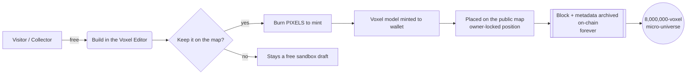

<!-- Lost Pixel Gems — open-source public voxel-art metaverse -->
<h1 align="center">◊ Lost Pixel Gems (LPG)</h1>
<p align="center"><b>Virtual worlds & multi-experience voxel art — fully on-chain, open source.</b><br>
Millions of pixels, mobilized and accumulated into forms that represent art — created by <b>D.C.O.T. and anyone who wants to contribute.</b></p>

<p align="center"><i>Burn PIXELS → mint voxel worlds → build one shared 8,000,000-voxel micro-universe that lives forever on-chain.</i></p>

<p align="center">
  <a href="https://lostpixelgems.space/"><b>🌐 Project — lostpixelgems.space</b></a> ·
  <a href="https://dcot.space/"><b>🎨 Portfolio — D.C.O.T.</b></a> ·
  <a href="https://x.com/DCOT15"><b>𝕏 @DCOT15</b></a>
</p>

---

## What this is

**Lost Pixel Gems are millions of pixels — mobilized and accumulated into forms that represent art.** It is not one app but a **connected set of virtual worlds and experiences** around a single idea: a free, collaborative voxel canvas that anyone can build, authored by **D.C.O.T. and every contributor**.

It is **multi-experience** — one project, many ways to enter it:

| Experience | You… |
|---|---|
| **🏙 Lost Pixel City** | Walk a metropolis of gem-portals in first/third person |
| **🚪 Rooms** | Step *through a portal* into a collector's private, editable voxel room |
| **✏ Voxel Editor** | Build any model 1:1 (MagicaVoxel-style) — free to draft |
| **🌍 Public Voxel Map** | **Enter as a single pixel** and roam the shared 8000×256 world |
| **⛓ Explorer / Owners / Digital Life / Game** | Read the chain, see collectors, watch gems evolve, play |

Keeping a construction is an **on-chain, deflationary event**: **PIXELS** tokens are **burned** to mint voxel models; the blocks that stay in position are archived — forever — with their metadata. The result is a **micro-universe of ~8,000,000 voxels** burned into virtual constructions: a living, walkable, permanent work of open public art. **You can enter `lpg-map` as a single pixel and walk the world from the inside.**

This repository is the **open-source reference** — every app, page, the smart-contract layer, and the economic + cultural vision — with **no private data** (no databases, keys, wallets, or user content). See the **[value showcase](documentation/lost-pixel-gems-docs/docs/03-productos-servicios/SHOWCASE.md)** for the visual tour.

> **📖 Start here:** the illustrated **[GENESIS publication](GENESIS.md)** — the whole project in one page (with screenshots) — and **[Experiment R3, the origin of the artistic concept](documentation/lost-pixel-gems-docs/docs/02-conceptos/ORIGIN.md)**.

## Table of contents
- [**GENESIS — the illustrated publication**](GENESIS.md) · [**Manifesto & vision**](documentation/lost-pixel-gems-docs/docs/02-conceptos/MANIFESTO.md) · [**R3 — origin**](documentation/lost-pixel-gems-docs/docs/02-conceptos/ORIGIN.md)
- [Vision](#vision) · [Architecture](documentation/lost-pixel-gems-docs/docs/02-conceptos/ARCHITECTURE.md) · [The apps & pages](documentation/lost-pixel-gems-docs/docs/02-conceptos/APPS.md)
- [**Creation tools** (free — edit & animate)](documentation/lost-pixel-gems-docs/docs/01-guias/TOOLS.md) · [**Functions, limits & comparison**](documentation/lost-pixel-gems-docs/docs/02-conceptos/COMPARISON.md) · [**Public math & code**](documentation/lost-pixel-gems-docs/docs/02-conceptos/TECHNICAL.md)
- [Economic model (deflationary PIXELS burn)](documentation/lost-pixel-gems-docs/docs/02-conceptos/ECONOMY.md) · [**Collections: distribution, launch & burns**](documentation/lost-pixel-gems-docs/docs/01-guias/DISTRIBUTION.md)
- [Smart contracts](documentation/lost-pixel-gems-docs/docs/02-conceptos/CONTRACTS.md) · [Contributing & audits](CONTRIBUTING.md)
- [Run it locally](#run-it-locally) · [Deploy](#deploy) · [License](#license)

---

## Vision

> **Open public art, owned by no one and everyone.** Culture is built by contribution; permanence is earned by burning.

- **Cultural** — a shared canvas where collectors and visitors co-author a pixel city. Every gem is a room; every room is a world.
- **Economic** — a **deflationary** loop: minting a construction **burns PIXELS**, so the more the world is built, the scarcer the token becomes. Value accrues to *permanence*.
- **Public art / open source** — the protocol, the tools, and the art pipeline are open. Anyone can fork the editor, run the map, or read every block's metadata straight from the chain.



---

## Run it locally

The site is **static** (HTML + JS, three.js). The only server is the **public map** (placement persistence).

```bash
# 1) serve the static site (any static server)
npx serve .            # or: python3 -m http.server 8080

# 2) the public map — pick ONE backend:
#    a) Node:  cd server/node && npm install && node server.js
#    b) PHP :  point Apache/PHP at server/php/  (SQLite, no Node needed)
```
Open `index.html`. Walk the city, open a gem portal, edit a room, or **enter `lpg-map` as a pixel**.

> Heavy 3D model binaries (`.glb` / `.vox`, ~250 MB) are **not** committed to git — see [`documentation/lost-pixel-gems-docs/docs/04-recursos/ASSETS.md`](documentation/lost-pixel-gems-docs/docs/04-recursos/ASSETS.md) for how to generate or fetch them. The code, tools and pipeline are fully here.

## Deploy
- **Static site** → any host (GitHub Pages, Netlify, shared hosting).
- **Public map** → Node host **or** plain PHP + SQLite (`server/php/`). See [`documentation/lost-pixel-gems-docs/docs/01-guias/DEPLOY.md`](documentation/lost-pixel-gems-docs/docs/01-guias/DEPLOY.md).

## Repository layout
```
web/                        all pages & apps (city, editor, room, map viewer, explorer…)
web/assets/                 js, css, icons (light, versioned assets only)
server/node/                public-map server — Node + SQLite (standalone)
server/php/                 public-map server — PHP + SQLite (shared hosting)
contracts/                  contract addresses, ABIs & notes
documentation/              organized documentation and smart contracts reference
```

## Credits & links
Created by **D.C.O.T.** and every contributor to the commons.
- 🌐 **Project:** https://lostpixelgems.space/
- 🎨 **Portfolio:** https://dcot.space/
- 𝕏 **Social:** https://x.com/DCOT15

## License
Released under the **MIT License** — see [LICENSE](LICENSE). Art direction & the "Lost Pixel Gems" name © D.C.O.T.; the code is free to fork, study and build on.
