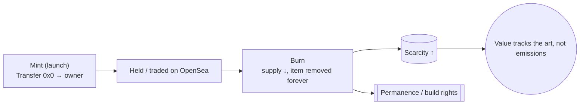
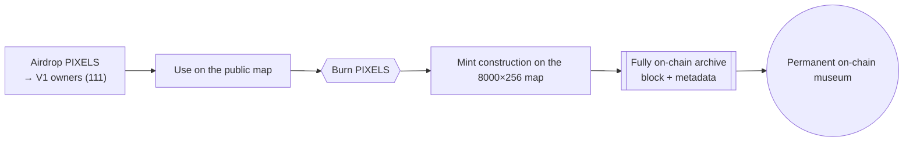

# Collections — Distribution, Launch & Burn Analysis

> **The metadata of every token is the property of its holder.** This analysis reads *public* on-chain state only — no private data.

Data below is read live from Ethereum mainnet via public RPC (`totalSupply`, `name`, `symbol`, `balanceOf(burn)`), and cross-checked against OpenSea / Etherscan. Numbers marked *live* were fetched at authoring time; **verify anytime with the links** — that's the point of an on-chain project.

## 1. The six collections (verified on-chain)

| Collection | Symbol | Contract | Supply (live) | Burned | Type |
|---|---|---|---|---|---|
| **LOST PIXEL GEMS V1** | `LPG` | [`0xb52c…3A44`](https://etherscan.io/address/0xb52cD7A93878D823dF0fBc4F2E5a42f7b5B53A44) | 111 (no `totalSupply()` → non-enumerable/1155) | — | Genesis gems |
| **LOST PIXEL GEMS V2** | `LPGNTRCTV` | [`0xb869…f01B`](https://etherscan.io/address/0xb8698f54BEAd61D0C34e60Ab49d5AC992674f01B) | **80** (from 86 minted) | **6 burned** | Interactive gems |
| **LOST PIXEL LANDS** | `LPL` | [`0x8091…c695c`](https://etherscan.io/address/0x80910b1210f2bdcb1122cac6b76a3ed28c9c695c) | non-enumerable | — | Land parcels |
| **LOST PIXEL GEMS RESOURCES** | `LPGR` | [`0x6912…dc548`](https://etherscan.io/address/0x6912dfdb9cff40a20fd1c297374bcbbd5d6dc548) | non-enumerable (1155-style) | — | Resources |
| **LPC-BOT** | `BOTTT` | [`0x3560…5ccf`](https://etherscan.io/address/0x3560dc18d27888de170acbc119442db3fdcf5ccf) | non-enumerable | — | Bot avatars |
| **ABS.tract series by D.C.O.T.** | `ABS` | [`0x848f…7aa0a`](https://etherscan.io/address/0x848f15ba0a652b09438c9747e80304147d87aa0a) | **6** | — | Fine-art series |

**Verify live:** each contract on [Etherscan](https://etherscan.io) (mints = `Transfer` from `0x0`; burns = `Transfer` to `0x0`/`0xdead` or supply decrease) and on [OpenSea](https://opensea.io) (`/assets/ethereum/<contract>`) for items, owners, and sales.

## 2. Launch & distribution (how to read it from the chain)

Everything is reconstructable from **mint transactions**:

```
minted(id)  = first Transfer( from = 0x0 → owner )      // the launch/primary distribution
bought      = subsequent Transfer( owner → owner )       // secondary (OpenSea etc.)
burned      = Transfer( → 0x0 / 0xdead ) OR totalSupply decrease
holders     = current owner set from the Transfer log
```

- **V1 (111 gems):** the genesis distribution — the original hand-authored collection that seeds the whole metaverse and gates the map (owning a gem = owning a room).
- **V2 (86 → 80):** launched at **86**, now **80** — **6 were burned** (see §3). Companion "interactive" gems.
- **ABS (6):** a tiny, deliberate fine-art series by D.C.O.T. — scarcity by intent.
- **LPL / LPGR / BOTTT:** lands, resources, and bot avatars — the supporting economy (parcels to build on, resources, and the avatars you walk the world with).

> To pull exact per-collection mint dates, buyers, and sale prices, use the OpenSea/Etherscan links above or the project's own [`explorer.html`](../web/explorer.html) and [`owners.html`](../web/owners.html), which read this same on-chain data live.

## 3. Why burn? (the rationale)

The **6 burned V2 tokens are the genesis proof** of the mechanic the whole economy is built on: **burning to build.**

1. **Deflation is authored, not printed.** In Lost Pixel Gems there is no inflation — the only supply change is *downward*. Every burn permanently removes an item from circulation.
2. **Burning earns permanence.** In the PIXELS economy, you **burn to mint** — you give up a fungible unit to make a *construction permanent* on the shared map (see [ECONOMY](ECONOMY.md)). The 6 V2 burns are the first, on-chain demonstration of that value exchange.
3. **Scarcity ↔ art.** As more of the world is built (toward the **8,000,000-voxel** micro-universe), more is burned, so remaining supply becomes scarcer — value tracks *creative output*, not emissions.
4. **Curation by subtraction.** Removing tokens is an artistic act too — a fine-art series (ABS = 6) and a pruned V2 (86 → 80) show intent: **less, but permanent.**



## 4. PIXELS distribution & future plans

**Initial distribution — an airdrop to the genesis holders.**

- **PIXELS airdrop to V1 owners.** The **111 V1 (`LPG`) gem holders** — the genesis collectors — receive the initial **PIXELS** allocation by airdrop. Distribution starts with the people who seeded the artwork.
- **No sale to create, no subscription.** PIXELS exist to *fuel permanence*, not to gate creativity. Building and drafting stay free (see [MANIFESTO](MANIFESTO.md)).

**Use — the fully on-chain public map.**

| Phase | What happens | On-chain |
|---|---|---|
| **Airdrop** | V1 owners receive PIXELS | ERC-20 mint to holders |
| **Build** | Anyone drafts models with the free tools | off-chain (free) |
| **Keep** | **Burn PIXELS → mint a construction onto the public map** | `mintVoxel(...)` — supply ↓ |
| **Archive** | Kept block + metadata written on-chain | `MapArchive` — permanent |
| **Museum** | The 8,000,000-voxel world becomes a **fully on-chain permanent collection** | rebuildable from contract data |



**Why this order:** the people who believed first (V1) get the first PIXELS; those PIXELS are then *spent by burning* to build the shared, **fully on-chain** map — so the initial distribution flows directly into the creation of the permanent public artwork. Circulating PIXELS only ever **decrease** as the world is built.

> The **public map** (`lpg-map`) is designed to run from **contract data alone** — if every server disappears, the world can be rebuilt from the chain. That is what "fully on-chain" means here: the art is not hosted, it *is* the chain.

## 5. Holder rights
- **Metadata is the holder's property** — displayed read-only in rooms via a 6-word *signed* message (view permission only, never a transfer).
- Owning a **V1 gem** unlocks editing its room and building on the map.
- The chain is the record: distribution, sales, and burns are all publicly auditable at the links above.

*Live figures fetched via public RPC at authoring time; treat Etherscan/OpenSea as the source of truth and re-verify — this is an on-chain, auditable project.*
