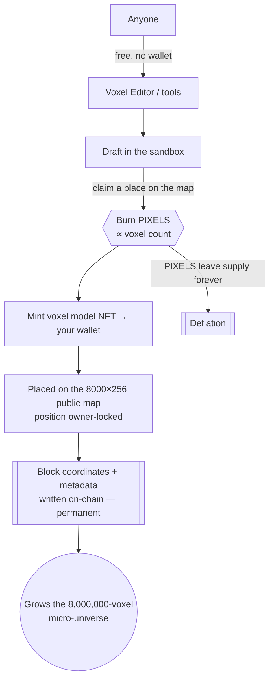
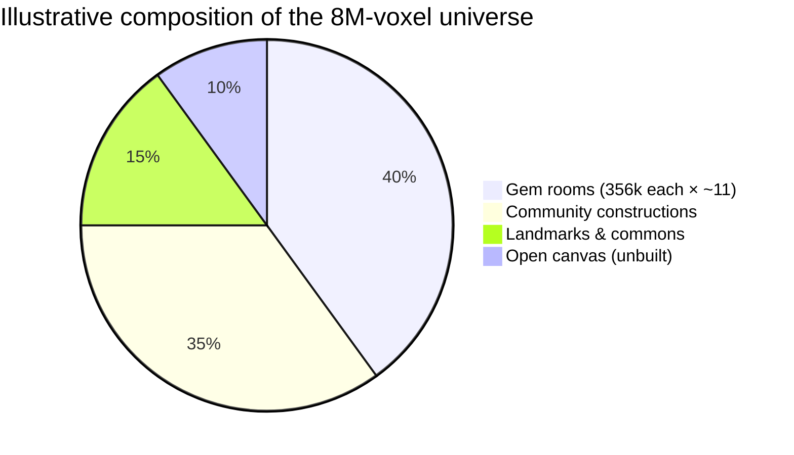
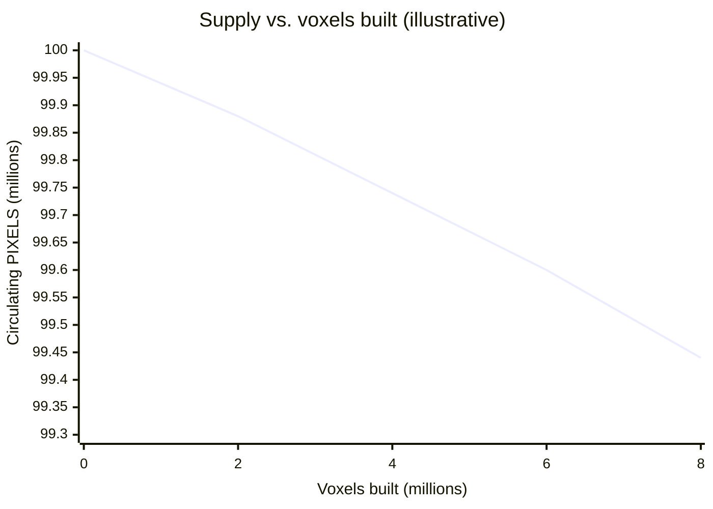

# The PIXELS Economy — a deflationary public-art protocol

> **Lost Pixel Gems are millions of pixels — mobilized and accumulated into forms that represent art** — created by **D.C.O.T. and anyone who wants to contribute.** Permanence in that shared world is earned by **burning PIXELS**, which makes the token deflationary as the art grows.

This document defines the token model, the burn-to-mint mechanism, and the road to a **~8,000,000-voxel on-chain micro-universe**. Numeric constants shown as *examples* are the **model framework**; final values are set at contract deployment.

---

## 1. The core loop

Free to create. Costly to make permanent. Permanent means archived forever.

- **Create = free.** The editor and map are open; drafting costs nothing.
- **Keep = burn.** To lock a construction into the canonical map, you **burn PIXELS**.
- **Kept = archived.** Blocks that remain in position are stored with metadata on-chain, permanently — the art cannot be un-made.

---

## 2. Token parameters (example framework)

| Parameter | Value (example) | Notes |
|---|---|---|
| Token | **PIXELS** (ERC-20) | The single fungible unit of the economy |
| Decimals | 18 | Standard |
| Initial supply | 100,000,000 PIXELS | Minted once at genesis |
| Emission after genesis | **0** | No inflation — supply only ever *decreases* |
| Sink | **Burn on mint** | Every permanent placement burns PIXELS |
| Burn address | `0x…dEaD` | Verifiable, irreversible |

**Deflation is structural:** there is no faucet and no new emission. The *only* flows are transfers and **burns**. Every act of permanence shrinks the supply.

---

## 3. Burn-to-mint pricing (per construction)

Cost scales with the **voxel footprint** of what you make permanent — bigger art, bigger burn.

| Tier | Voxels in the model | PIXELS burned (example) | Effective rate |
|---|---|---|---|
| Pixel | 1 – 1,000 | 100 | 0.1 / voxel |
| Sprite | 1,001 – 10,000 | 800 | ~0.08 / voxel |
| Room | 10,001 – 100,000 | 6,000 | ~0.06 / voxel |
| World | 100,001 – 356,000 | 18,000 | ~0.05 / voxel |

> Rates are **regressive per-voxel** on purpose: ambitious builders who fill more of the universe get a better unit price, rewarding contribution to the shared canvas. A gem "garden" room is ~356,000 voxels.

---

## 4. The 8,000,000-voxel micro-universe

The public map is **8,000 wide × 256 tall** — a single level whose target is a **micro-universe of ~8,000,000 permanently-burned voxels**. Filling it is the collective art goal.

| Milestone | Voxels placed | Cumulative PIXELS burned (est.) | Supply remaining |
|---|---|---|---|
| Seed | 1,000,000 | ~55,000 | 99,945,000 |
| Quarter | 2,000,000 | ~120,000 | 99,880,000 |
| Half | 4,000,000 | ~260,000 | 99,740,000 |
| Full universe | **8,000,000** | **~560,000+** | **99,440,000 −** |

As construction approaches 8M voxels, **cumulative burn rises monotonically** and circulating PIXELS falls monotonically — scarcity tracks the completeness of the artwork.

---

## 5. Roles & rights

| Role | Can | Cost |
|---|---|---|
| **Visitor** | Walk the map **as a pixel**, enter portals, view rooms & NFTs | Free |
| **Contributor** | Build models, add optimized 3D/voxel files to the mixed map | Free to draft |
| **Collector (V1 owner)** | Own a gem, edit its room, place & **own-lock** constructions | Burn PIXELS to make permanent |
| **Delegate** | Edit an owner-granted parcel/quadrant | Set by the owner |
| **Archive (protocol)** | Store kept blocks + metadata on-chain forever | Immutable |

- **Read-only NFT exhibition:** collectors can *display* wallet NFTs in their rooms with a 6-word signed message — **view permission only, never a transfer**. The NFTs stay safe in the wallet.
- **Owner-locked positions:** anyone may move an *unlocked* draft; a *locked* (minted) position moves only by its owner.

---

## 6. Why deflation + public art work together

1. **Scarcity is authored, not printed.** PIXELS only leave supply when someone commits art to permanence — value is tied to creative output, not speculation emissions.
2. **The commons compounds.** Every burn adds a permanent block to a single shared universe anyone can walk — the artwork itself is the yield.
3. **Open by construction.** Blocks + metadata are on-chain and readable by anyone; the map can be rebuilt from contract data alone, so the art outlives any server.

> **You can enter `lpg-map` as a single pixel and walk this world from the inside** — every block you pass was a choice someone made to burn for permanence.
