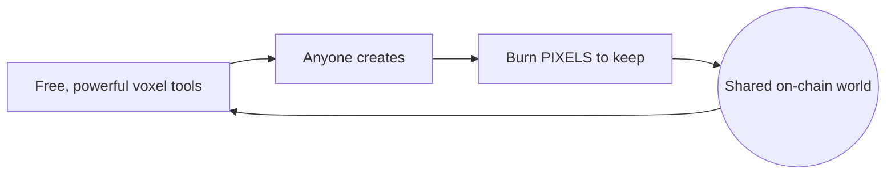

# Manifesto — Creative Intention & Vision

## Creative intention

Lost Pixel Gems exists to prove one idea: **the pixel is matter, and art is what we accumulate from it.** Beginning with [Experiment R3](ORIGIN.md), the project treats every voxel not as decoration but as a *unit of creation* — something anyone can mobilize, give form, and make permanent.

We are not building a game or a marketplace. We are building a **living public artwork** that also happens to be a protocol — authored by **D.C.O.T. and anyone who chooses to contribute.**

## Manifesto

1. **Creation is free.** The tools cost nothing — **no wallet to connect, no subscription to pay.** You create **for the love of voxel & pixel art.** A wallet is only ever needed for the *optional* act of making a work permanent.
2. **Permanence is earned.** To keep something forever, you burn PIXELS — permanence has weight because scarcity is *authored*, not printed.
3. **The commons compounds.** Every kept block joins one shared, walkable universe. The artwork is the yield.
4. **Open by construction.** Code is MIT, art is credited, blocks + metadata are on-chain and readable by all. The world can be rebuilt from the chain alone — it outlives any server.
5. **Interoperable, not captive.** Standard formats in and out (`.vox / .obj / .glb / .gltf / .vrm`). Your art is yours to take anywhere.
6. **Audited in the open.** Contracts and code invite scrutiny; no backdoors, no hidden mint, structural deflation.
7. **One and many.** The signature is D.C.O.T.'s; the canvas is everyone's.

## Vision — the most powerful free voxel-art application

Our shared goal is to build, **together and in the open, the most powerful free-to-use application for creating voxel art** — and to make it the front door to a permanent on-chain world.

**What "most powerful free" means for us:**
- A **browser-native** editor as capable as it needs to be — brushes, shapes, selection, layers, gizmo, AI assist, **animation & play**, multi-format import/export. *(today — see [TOOLS](TOOLS.md) & [COMPARISON](COMPARISON.md))*
- A future **2D Pixel Art Studio** feeding the same pipeline.
- **On-chain save** so a creation becomes a permanent, provable artwork.
- **Zero cost to create**, forever — monetization only ever attaches to *permanence*, never to the act of making.

## Future — the fully on-chain Museum

The endgame is a **permanent, fully on-chain museum**: the kept blocks and their metadata become a **permanent collection** that lives on the Ethereum Virtual Machine forever — curated by contribution, owned by no one, walkable by everyone.

| Horizon | What |
|---|---|
| **Now** | Free tools, free creation — no wallet, no subscription |
| **Next** | 2D Pixel Art Studio · `.vox/.obj/.glb → SVG/HTML` viewer · on-chain save |
| **Museum** | A **fully on-chain museum** — the 8M-voxel micro-universe as a **permanent collection** that outlives every server |

> You are showing the way; the repo is how we build it together. Fork it, audit it, extend it — every contribution is a line in the same artwork R3 began.

*— D.C.O.T. and contributors · [lostpixelgems.space](https://lostpixelgems.space/) · [dcot.space](https://dcot.space/) · [@DCOT15](https://x.com/DCOT15)*
