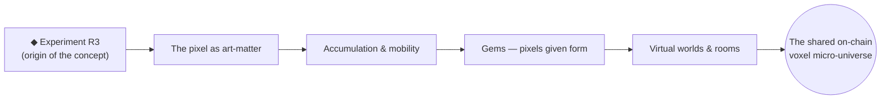

# R3 — The Origin of the Artistic Concept

> **Everything here begins with the experiment R3.**

**R3** is the genesis experiment of Lost Pixel Gems — the origin point of the artistic concept from which every gem, room, portal, and the whole voxel micro-universe grew. It is the seed idea:

> *Millions of pixels, mobilized and accumulated into forms that represent art.*

## Why R3 matters

Lost Pixel Gems is not a product that happened to become art — it is an **artwork that became a protocol**. R3 is where that inversion started: the experiment that treated the **pixel** not as a unit of display, but as a unit of **matter** — something that can be **accumulated, mobilized, given form, and made permanent**.

From R3 flow the core principles that define the whole project:

| From R3 → | Became in Lost Pixel Gems |
|---|---|
| The pixel as **matter** | Voxels you burn to make permanent |
| **Accumulation** as form | The 8,000,000-voxel micro-universe |
| **Mobility** of pixels | Walking the map *as a pixel*; models that move & animate |
| Art by **one and many** | Authored by **D.C.O.T. and every contributor** |
| Experiment → **permanence** | On-chain archive: kept blocks live forever |

## The lineage

R3 is the **why** beneath the tokenomics and the tools: the economy exists to give *weight* to permanence, and the tools exist to let anyone continue the experiment. Every construction added to the world is a new line in the same artistic investigation that R3 began.

## Creative process (images)

The visual record of the concept — including R3 and how the pixel-as-matter idea took form — lives in the **Creative Process** page of the site:

- 🖼 **In the site:** `web/process.html` → *Creative Process* (the process imagery of D.C.O.T.)
- 🌐 **Live:** https://lostpixelgems.space/process.html

That section is the primary reference for the artistic origin; this document frames it in the repo so the R3 concept sits at the center of everything.

---

*The full narrative and provenance of Experiment R3 are authored by **D.C.O.T.** — see the [portfolio](https://dcot.space/) and [project site](https://lostpixelgems.space/). This document places R3 at the center of the concept so the code and economy are always read as extensions of the original artwork.*
