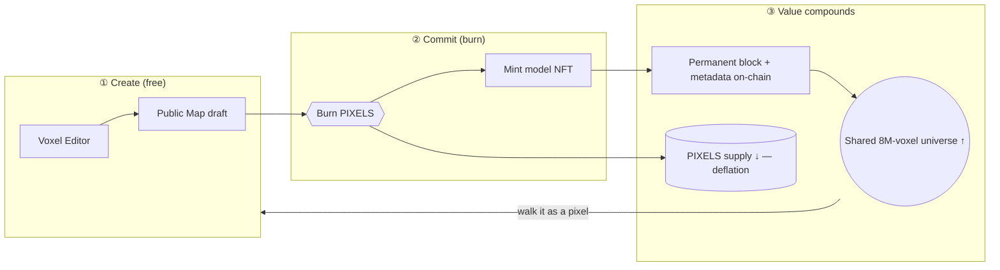

# Value Showcase — the site, its experiences & events

A visual + structured tour of what Lost Pixel Gems *is* and where its value comes from. Screenshots are captured directly from the running site.

## Lost Pixel City — the hub world

*A honeycomb of gem-portals on an open meadow: unique swirling spirals per gem, NFT frames at eye height, a wireframe neon skyline, an animated galaxy sky, and free-flying spectator rooms behind each portal.*

## The value chart

Value in LPG is **authored, not emitted** — it accrues to permanence and to the growing commons.

| Value driver | Mechanism | Direction |
|---|---|---|
| **Scarcity** | PIXELS burned on every permanent mint | supply ↓ |
| **Commons** | Kept blocks archived forever, walkable by all | universe ↑ |
| **Provenance** | Every block + metadata readable on-chain | trust ↑ |
| **Utility** | Own a gem → own an editable room/world | experiences ↑ |
| **Culture** | Art by D.C.O.T. **and** every contributor | participation ↑ |

## Experiences & events (the multi-experience map)

| Experience | Page | The moment of value |
|---|---|---|
| Explore the city | `lost-pixel-city.html` | Walk gem-portals in first/third person |
| Enter a room | `room.html` (spectator play mode) | Step through a portal into a live voxel room |
| Build | `voxel-studio.html` | Create a model 1:1; owner-edits save & mirror live |
| **Be a pixel** | `lpg-map` (`/map/`) | Roam the shared world **as a single pixel** |
| Read the chain | `explorer.html` | Gems, owners, live transactions |
| Collectors | `owners.html` | Ranking & ownership across the 6 collections |
| Evolving art | `digital-life.html` | Gems change with real-world data |
| Play | `game.html` | Interactive pixel-art game |

> To regenerate this gallery from the live site, capture each page and drop the PNGs into `docs/img/` with the filenames referenced above.
