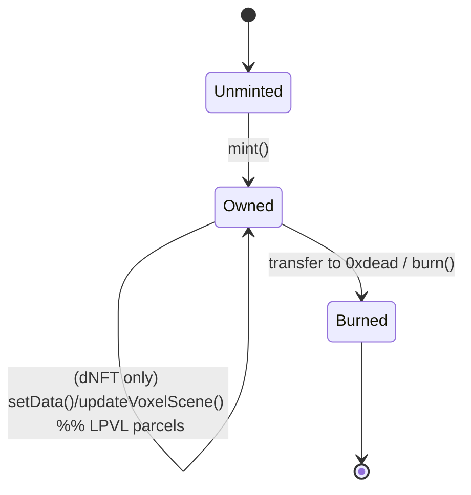
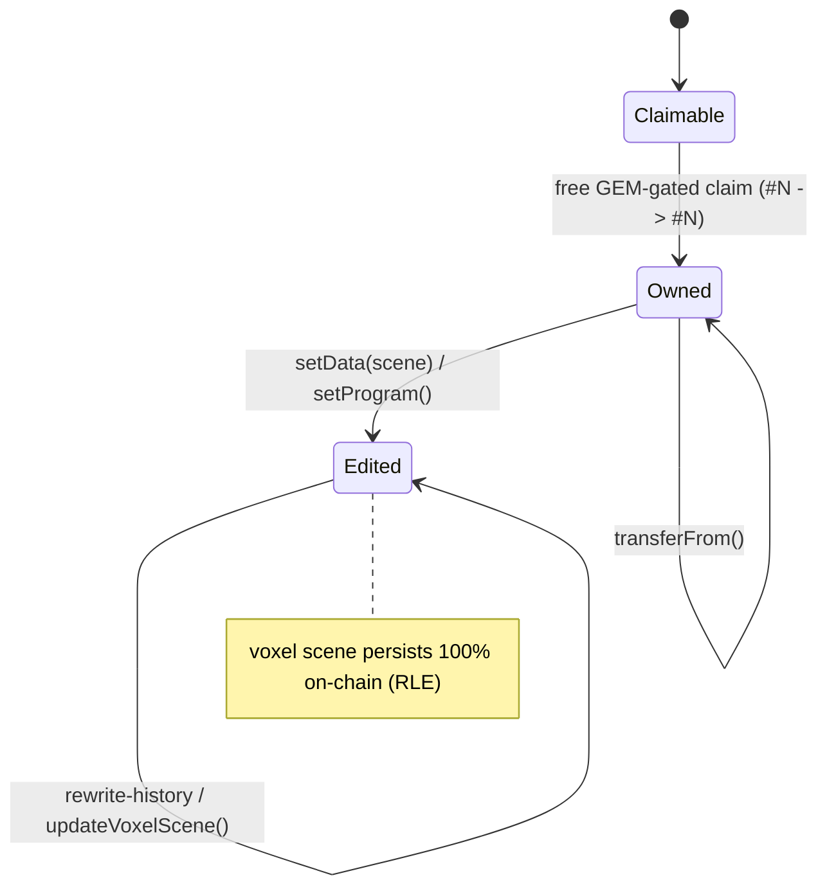
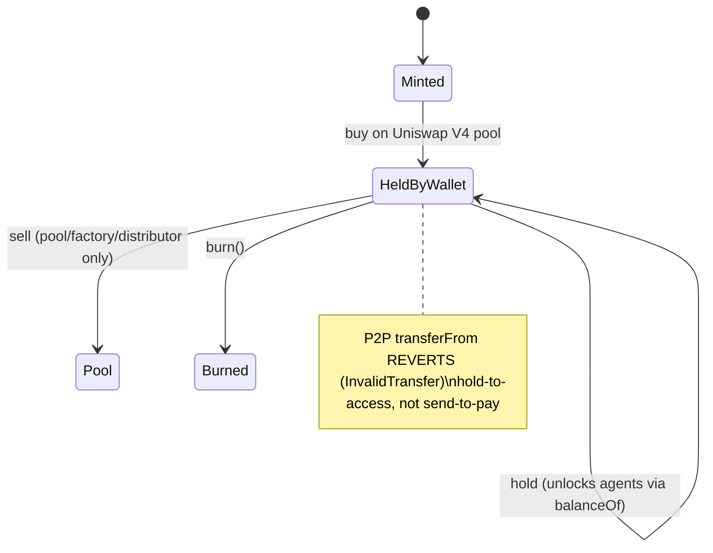
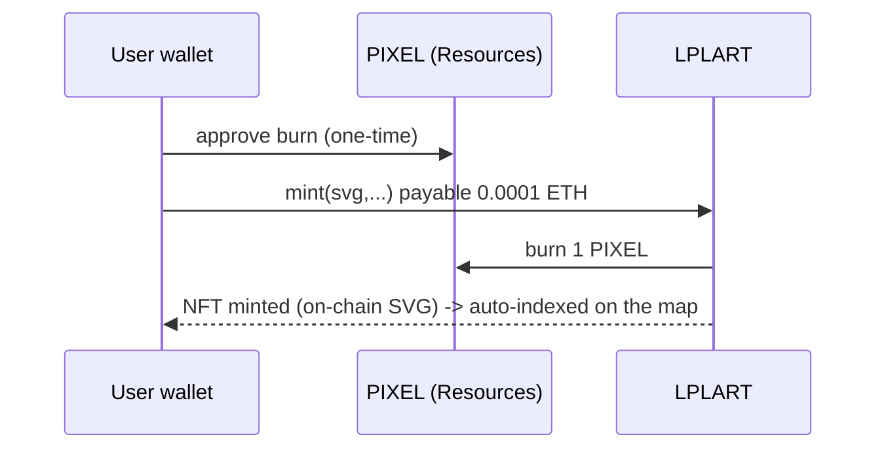
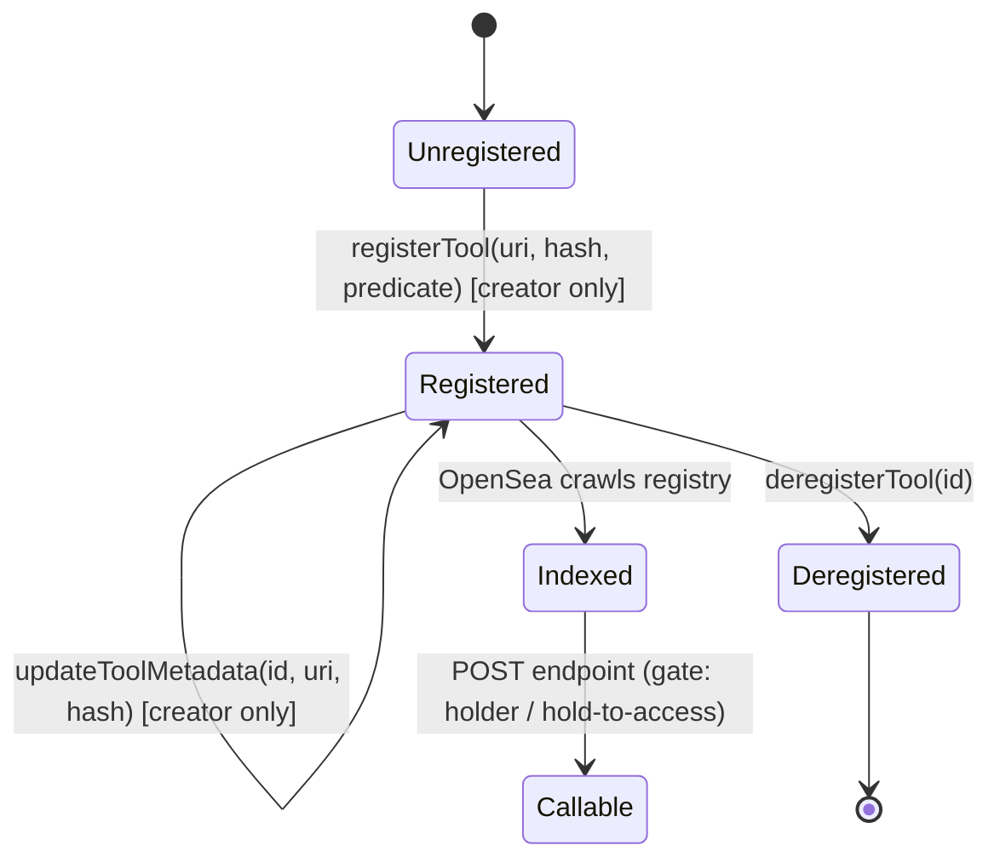

# Contract state diagrams

Mermaid diagrams of the lifecycle of each contract family. (GitHub renders Mermaid natively.)

## ERC‑721 collection (gems, BOTs, LAND, LPLART, GEM…)

## Lost Pixel Vox LAND (LPVL — dynamic NFT)

## $BOTTT (ERC‑20, transfer‑gated)

## PIXEL / mint flow (LPLART pixel‑art)

## ERC‑8257 agent tool

